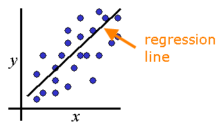

```{r setup, include=FALSE}
knitr::opts_chunk$set(echo = FALSE)
library(dplyr)
library(knitr)
library(xtable)
library(keras)
library(ggplot2)
options(xtable.comment = FALSE)
```

## Outline
1. Overview of Keras

2. RNN/LSTM

3. Using Generator Functions

4. How to RNN/

5. Temperature Prediction Example (time permitting)

6. Final Thoughts 

## What is BART?
```{r out.width="20%", fig.align='center'}
knitr::include_graphics("BART.png")
```
**B**ayesian **A**dditive **R**egression **T**rees

{width=25%} {width=18%} {width=31%} {width=22%}

## Interpretation
- Emsamble method combining many shallow trees
- Bayesian means variation is fully quantified
    - Yay Statistics


## Powerful Predictive Performance

- Table with simulation result

- bartMachine is relatively unknown
    - xgboost: ~43k downloads per month
    - randomForest: ~88k downloads per month
    - bartMachine: ~2k downloads per month


## Package Features:
- Functions for Cross Validation

- Model fitting:
    - Is done in parallel[^footnote]
    - Can incorporate missing data
    
- Lots of fun statistical things
    - Credible iterval calculation
    - Diagnostic plots/tests

- Variable selection

- Interaction detection

- Export fit trees

[^footnote]: MCMC


## Installation and loading steps
1) Google "How to install rJava on [your OS]"
2) Do that
3) Run the following

```{r BartInstallation, eval=FALSE, echo=TRUE}
install.packages("bartMachine")
```

To load the package with:

- 10GB of memory
- All but one core available for compute
```{r BartLoading, eval=FALSE, echo=TRUE}
options(java.parameters = "-Xmx10g")
library(bartMachine)
numcores <- parallel::detectCores()
set_bart_machine_num_cores(numcores - 1)
```

## Code Time
Coding demo

## Computational Considerations
- Table with memory/time


## John's Final Thought
- BART is a powerful technique which brings many advantages
    - At the expense of computational efficiency.
- Good results with removing expected variation and feeding residuals into BART.


