```{r setup, include=FALSE}
knitr::opts_chunk$set(echo = FALSE)
library(dplyr)
library(knitr)
library(xtable)
library(ggplot2)
library(MASS)
options(xtable.comment = FALSE)
```

## What is BART?
```{r out.width="20%", fig.align='center'}
knitr::include_graphics("BART.png")
```
**B**ayesian **A**dditive **R**egression **T**rees

{width=25%} {width=18%} {width=31%} {width=22%}

## How it works
- Ensemble method which is the sum of many shallow trees.
- Complexity is regularized via Bayesian "priors."
    - This frees us from ad hoc decisions
- Uses "Bayesian Backfitting"
    - Each tree is sequentially exposed to the residuals when all other trees are used to predict
    
    
Results:

- Each tree describes a tiny amount of the structure
- The Bayesian structure means variation is fully quantified.
    - Intervals, p-values, and model selection become possible
- Outperforms many common models in out of sample prediction.


## Powerful Predictive Performance

- Test RMSE of 100 random datasets simulated from various nonlinear functions (added noise with s=1)

| Function    | BART        | XGBoost\*       | Random Forest\* | Linear Reg(lol) |
| :---        |    :----:   |          :---: |  :----:   |  :----:   |
| Friedman      | 1.08       | 1.21   | 1.64   | 2.61   |
| Mirsha's Bird   | 1.53        | 2.78      | 2.90   | 26.59   |
| Weird Exp   | 1.04        | 1.05      | 1.07   | 6.08   |
| Linear   | 1.025        | 1.032     | 1.034   | 1.004   |

\vspace{-6mm}

\tiny Details in Simulation.R

\normalsize

- bartMachine is relatively unknown
    - xgboost: ~43k downloads per month
    - randomForest: ~88k downloads per month
    - bartMachine: ~2k downloads per month
    
- No full featured python library

\tiny *: Models fully cross validated

\normalsize

## Package Overview:
- Based in Java

- Functions for Cross Validation

- Model fitting:
    - Is done in parallel[^footnote]
    - Can incorporate missing data
    
- Lots of fun statistical things
    - Credible interval calculation
    - Diagnostic plots/tests

- Model free variable selection

- Interaction detection

- Export fit trees

[^footnote]: MCMC sampling is used, so speedups during model fitting aren't great


## Installation and loading steps
1) Google "How to install rJava on [your OS]"
2) Do that
3) Run the following

```{r BartInstallation, eval=FALSE, echo=TRUE}
install.packages("bartMachine")
```

To load the package with:

- 10GB of memory
- All but one core available for compute
```{r BartLoading, eval=FALSE, echo=TRUE}
options(java.parameters = "-Xmx10g")
library(bartMachine)
numcores <- parallel::detectCores()
set_bart_machine_num_cores(numcores - 1)
```

## Boston Data
We will consider the Boston dataset from the MASS package
\tiny

```{r Boston, eval=TRUE, echo=TRUE,include=TRUE}
data(Boston)
Boston %>% round(digits=2) %>% head
```

\normalsize

- Target: Predict median home value(medv)
- Features include:
    1. lstat: Proportion of low income individuals
    2. rm: Average umber of rooms per dwelling
    3. age: proportion of old homes
    4. etc...

## Fitting BART
\footnotesize

```{r BART_a, eval=FALSE, echo=TRUE}
y <- Boston$medv
X <- Boston %>% dplyr::select(-"medv")

#Fit BART model
bart.model <- bartMachine(X,y,
                          num_trees = 200,
                          num_burn_in = 1000,
                          num_iterations_after_burn_in = 5000)
```

\normalsize

BART is fit with MCMC, which requires a "burnin" set of initial iterations which are discarded.

- NOTE: with 10 cores, each thread would fit 1000 + 5000/10 or 1500 iterations

## The BART object
\footnotesize

````
> bart.model
bartMachine v1.2.3 for regression

training data n = 506 and p = 13 
built in 19.4 secs on 31 cores, 200 trees, 1000 burn-in and 5000 post. samples

sigsq est for y beforehand: 21.938 
avg sigsq estimate after burn-in: 2.70319 

in-sample statistics:
 L1 = 430.35 
 L2 = 654.72 
 rmse = 1.14 
 Pseudo-Rsq = 0.9847
p-val for shapiro-wilk test of normality of residuals: 0 
p-val for zero-mean noise: 0.98467 

````

\normalsize

Did we overfit?

## K fold CV using our fit model

\footnotesize

```{r BART_c, eval=FALSE, echo=TRUE}
k_fold_cv(X, y, k_folds = 10,
          num_trees = 200,
          num_burn_in = 1000,
          num_iterations_after_burn_in = 5000)
```

\tiny

````
..........
$y_hat
  [1] 24.932807 20.522438 31.149051 36.071931...

$L1_err
[1] 1022.238

$L2_err
[1] 4624.004

$rmse
[1] 3.02297

$PseudoRsq
[1] 0.8917508

$folds
  [1]  8 10  3  1 ....
````

\normalsize

Kindof, yes

## Select the number of Trees
\footnotesize

```{r BART_d, eval=FALSE, echo=TRUE}
rmse_by_num_trees(bart.model, num_replicates = 20)  
```

- This fits the model 20 times for a number of various numbers of trees
- Aggregates out of sample RMSE

\normalsize

\vspace{-4mm}

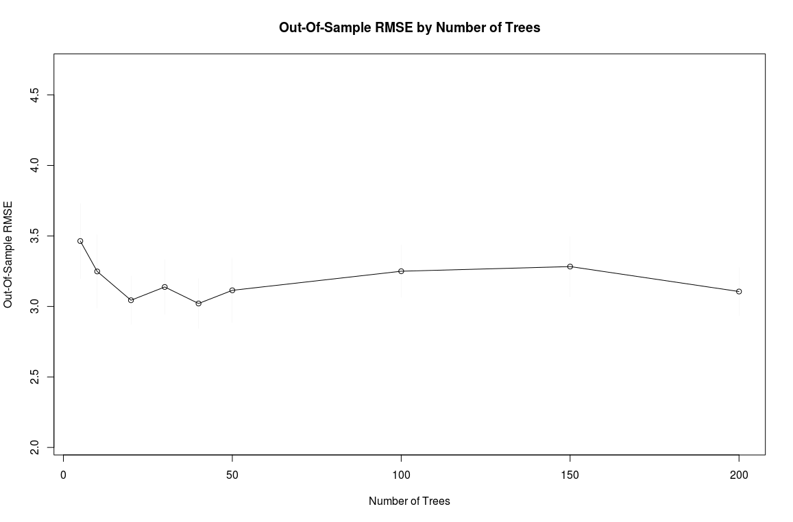{width=90%}


## Cross Validate

\footnotesize

```{r BART_e, eval=FALSE, echo=TRUE}
bart.model.cv <- bartMachineCV(X, y,
                               num_burn_in = 1000,
                               num_iterations_after_burn_in = 5000)
```

\normalsize

- To automatically cross validate, we just need to add a CV to the end of the function!

- Will fit a variety of models and return the best one.
    - Similar to the caret package

- This takes a while.

- bart.model.cv will be the model object for the best fit

## Cross Validate

\footnotesize

````
> bart.model.cv$cv_stats
      k nu    q num_trees oos_error % diff with lowest
 [1,] 2  3 0.90        50  2.860489           0.000000
 [2,] 3  3 0.90        50  2.922613           2.171807
 [3,] 2  3 0.99       200  2.924967           2.254080
 [4,] 2  3 0.90       200  2.933799           2.562845
 [5,] 2 10 0.75       200  2.956046           3.340573
 [6,] 2 10 0.75        50  3.036727           6.161102
 [7,] 3 10 0.75        50  3.040292           6.285746
 [8,] 3  3 0.99        50  3.060013           6.975171
 [9,] 3  3 0.90       200  3.086522           7.901900
[10,] 3  3 0.99       200  3.093631           8.150404
[11,] 3 10 0.75       200  3.123639           9.199475
[12,] 5  3 0.90        50  3.140318           9.782571
[13,] 5  3 0.99        50  3.158856          10.430626
[14,] 5 10 0.75        50  3.215616          12.414893
[15,] 2  3 0.99        50  3.342410          16.847512
[16,] 5  3 0.90       200  3.446951          20.502168
[17,] 5  3 0.99       200  3.447560          20.523454
[18,] 5 10 0.75       200  3.459553          20.942727
````

\normalsize

## Cross Validate

\footnotesize

```{r BART_e_2, eval=FALSE, echo=TRUE}
k_fold_cv(X, y, k_folds = 5,
          k=2, nu=3, q=.90, num_trees = 50,
          num_burn_in = 1000,
          num_iterations_after_burn_in = 5000)
```


````
.....

$rmse
[1] 2.92

$PseudoRsq
[1] 0.9138275
````

\normalsize

This is better than before!


## Variable Importance

\footnotesize

```{r BART_f, eval=FALSE, echo=TRUE}
investigate_var_importance(bart.model.cv)
```

\normalsize

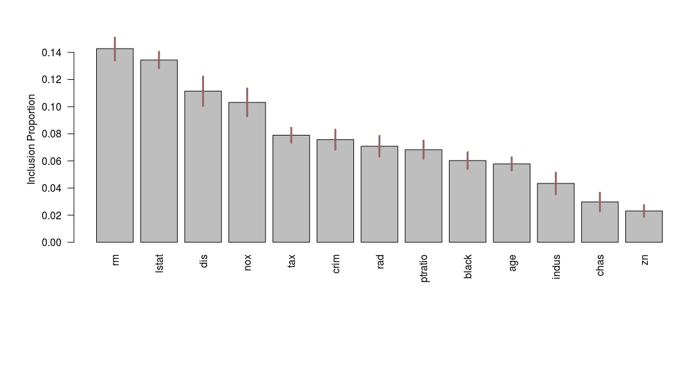{width=100%}


## Joint Variable Imortance

\footnotesize

```{r BART_g, eval=FALSE, echo=TRUE}
interaction_investigator(bart.model.cv)
```

\normalsize

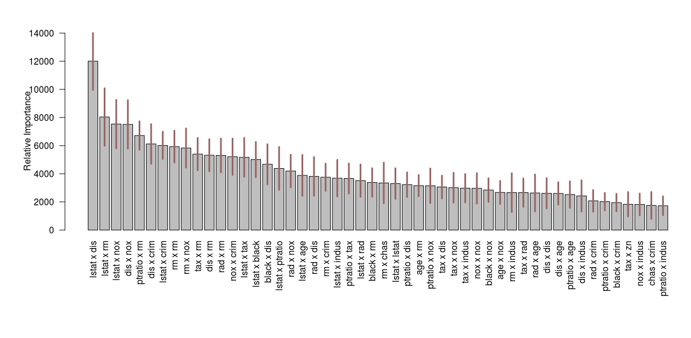{width=100%}

## Model Selection

\footnotesize

```{r BART_h, eval=FALSE, echo=TRUE}
VarSel <- var_selection_by_permute(bart.model.cv,bottom_margin = 5)
VarSel$important_vars_local_names
```


````
[1] "rm"    "lstat" "dis"   "nox"  
````

\normalsize

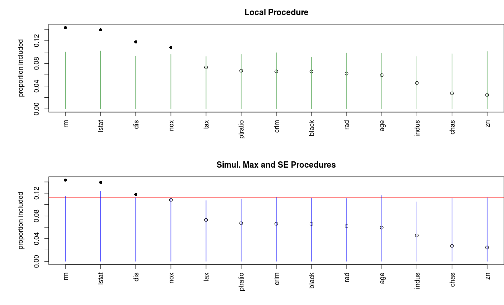{width=80%}

## Partial Dependence plots!
\footnotesize

```{r BART_i, eval=FALSE, echo=TRUE}
cov_importance_test(bart.model.cv, covariates = "lstat")
pd_plot(bart.model.cv, j = "lstat")
```

````
P-Value = 0
````

\vspace{-5mm}

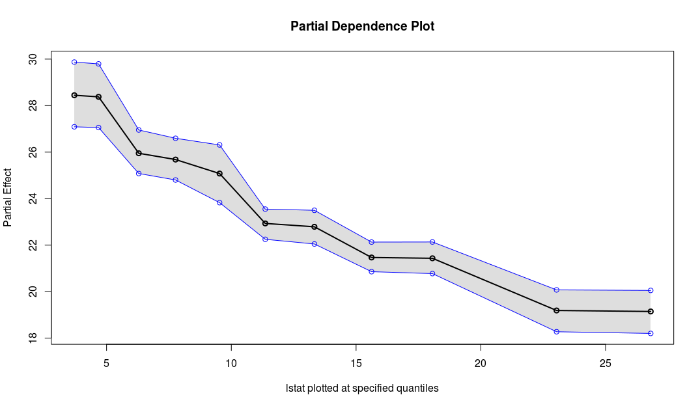{width=70%}

\normalsize

\vspace{-6mm}

- Low income areas have a negative relationship with home value

## Partial Dependence plots!
\footnotesize

```{r BART_j, eval=FALSE, echo=TRUE}
cov_importance_test(bart.model.cv, covariates = "rm")
pd_plot(bart.model.cv, j = "rm")
```


````
P-Value = 0
````

\vspace{-5mm}

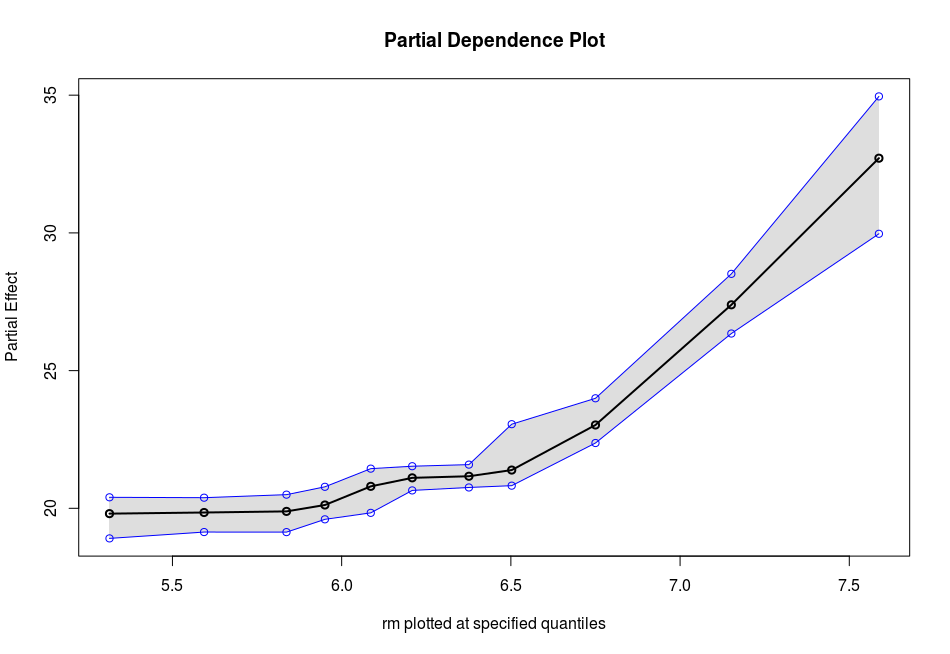{width=70%}

\normalsize

\vspace{-6mm}

- Number of rooms has a positive relationship with home value

## Conclusions supported by regressions

\tiny

```{r BART_k, eval=TRUE, echo=TRUE}
RegressMod <- lm(formula = medv ~ ., data = Boston)
summary(RegressMod)
```


## Aside: Partial Dependence
\footnotesize

```{r PD_a, eval=TRUE, echo=TRUE,fig.height=6}
nsim <- 1000
x1 <- runif(nsim,-3.14,3.14)
x2 <- runif(nsim,-3.14,3.14)

y <- x1 + sin(x2) + rnorm(nsim)
plot(x2,y)
```

\normalsize

## Aside: Partial Dependence
\footnotesize

```{r PD_b, eval=FALSE, echo=TRUE}
bart.model <- bartMachine(data.frame(x1,x2),y,
                          num_trees = 200,
                          num_burn_in = 1000,
                          num_iterations_after_burn_in = 4000)
pd_plot(bart.model, j = "x2")
```

\vspace{-6mm}

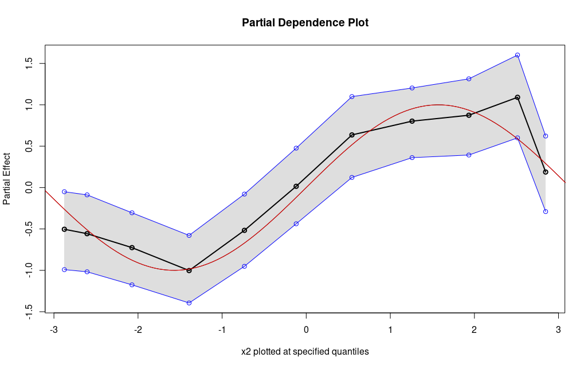{width=80%}

\normalsize

## Notable Arguments

\small

The bartMachine function has a number of arguments.  Default values are listed.

1. use_missing_data = FALSE
    - Uses rows with missing data *without* imputing

2. mem_cache_for_speed = TRUE

3. serialize = FALSE
    - Used to store the java object
    - save(bart.model, file="MyBart.Rdata")
    
4. cov_prior_vec = NULL
    - Place informative priors on variable inclusion
    
5. If y is a factor, classification is performed automatically.
    

## Other Statistical Things: Credible/Prediction intervals!

\footnotesize

```{r BART_assad, eval=FALSE, echo=TRUE}
MeanDF <- colMeans(X)
MeanDF %>% head
```


````
   crim     zn  indus  chas   nox    rm    age   dis
1 3.614 11.364 11.137 0.069 0.555 6.285 68.575 3.795
    rad     tax ptratio   black  lstat
1 9.549 408.237  18.456 356.674 12.653
````

\tiny
```{r BART_ghdr, eval=FALSE, echo=TRUE}
predict(bart.model.cv, newdata = MeanDF)
calc_credible_intervals(bart.model.cv, MeanDF, ci_conf = 0.95) %>% round(digits=2)
calc_prediction_intervals(bart.model.cv, MeanDF, pi_conf = 0.95) %>% round(digits=2)
```

\footnotesize

````
[1] 23.60462

     ci_lower_bd ci_upper_bd
[1,]       17.69        29.3
````

\normalsize


## Other Statistical Things: Assumption Checking

\footnotesize

```{r BART_effkd, eval=FALSE, echo=TRUE}
check_bart_error_assumptions(bart.model.cv)  
```

\vspace{-3mm}


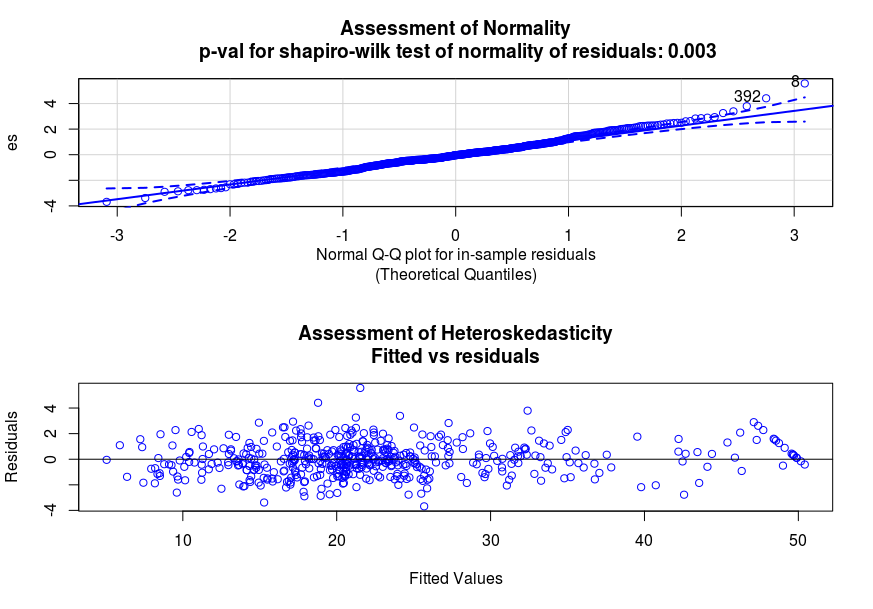{width=90%}


## Other Statistical Things: Convergence Diagnostics


\footnotesize

```{r BART_effdsfkd, eval=FALSE, echo=TRUE}
plot_convergence_diagnostics(bart.model.cv)  
```

MCMC must "converge"

\vspace{-2mm}

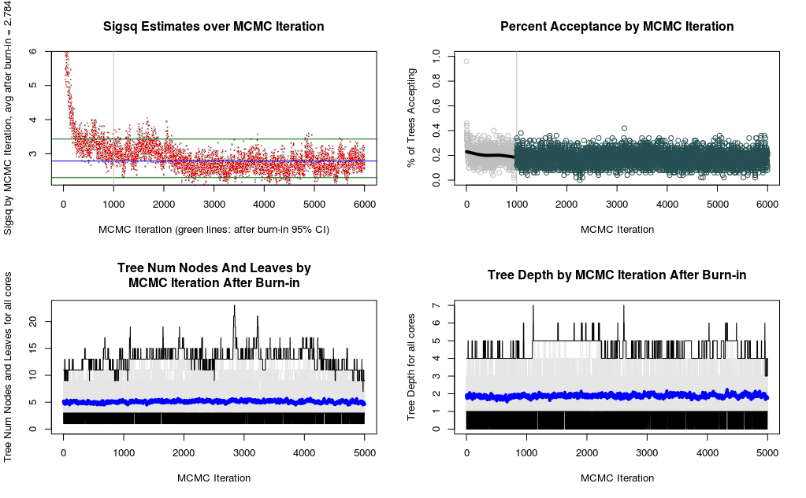{width=100%}


## Other Statistical Things: Observations vs Predictions


\footnotesize

```{r BART_effdgfkd, eval=FALSE, echo=TRUE}
plot_y_vs_yhat(bart.model.cv, credible_intervals = TRUE)
```


Looking for a 1:1 relationship

\vspace{-2mm}

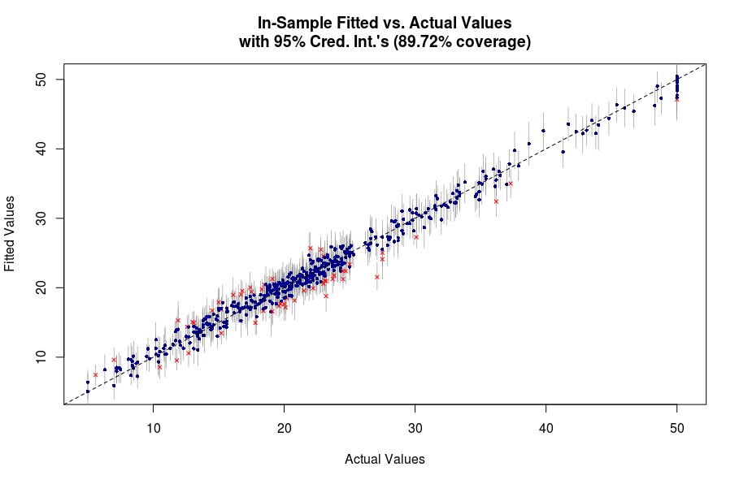{width=100%}


## John's Final Thought
- BART is a powerful technique which brings many advantages
    - At the expense of computational efficiency.

\vspace{-5mm}
\footnotesize
```{r Memory, eval=FALSE, echo=TRUE}
# n is 10000, p is 100
bart.model <- bartMachine(X,y,
                          num_trees = 100,
                          num_burn_in = 1000,
                          num_iterations_after_burn_in = 5000,
                          mem_cache_for_speed = TRUE)
```
\normalsize
\vspace{-5mm}
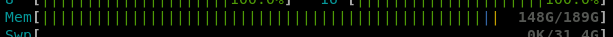{width=100%}

- Statistical advantages are numerous
- Package authors aggregated many academic works on BART
- Great for small to mid sized data
- Good results with removing expected variation and feeding residuals into BART.


