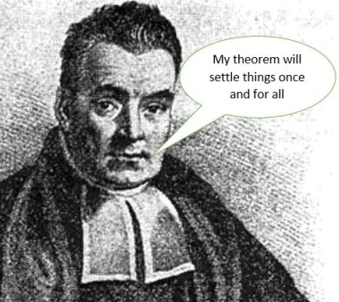

```{r setup, include=FALSE}
knitr::opts_chunk$set(echo = FALSE)
library(dplyr)
library(knitr)
library(xtable)
library(ggplot2)
library(MASS)
options(xtable.comment = FALSE)
```

## Outline
1. Brief BART overview


2. Installation and features


3. Demo


4. Further Considerations

## What is BART?
```{r out.width="20%", fig.align='center'}
knitr::include_graphics("BART.png")
```
**B**ayesian **A**dditive **R**egression **T**rees

{width=25%} {width=18%} {width=31%} {width=22%}

## How it works
- Emsamble method which is the sum of many shallow trees.
- Complexity is regularized via Bayesian "priors."
    - This frees us from ad hoc decisions
- Uses "Bayesian Backfitting"
    - Each tree is sequentially exposed to the residuals when all other trees are used to predict
    
    
Results:

- Each tree describes a tiny amount of the structure
- The Bayesian structure means variation is fully quantified.
    - Intervals, p-values, and model selection oh my!
- Outperforms many common models in out of sample prediction.


## Powerful Predictive Performance

- Test RMSE of 100 random datasets simulated from various nonlinear functions (added noise with s=1)

| Function    | BART        | XGBoost\*       | Random Forest\* | Linear Reg(lol) |
| :---        |    :----:   |          :---: |  :----:   |  :----:   |
| Friedman      | 1.08       | 1.21   | 1.64   | 2.61   |
| Mirsha's Bird   | 1.53        | 2.78      | 2.90   | 26.59   |
| Weird Exp   | 1.04        | 1.05      | 1.07   | 6.08   |
| Linear   | 1.025        | 1.032     | 1.034   | 1.004   |

\vspace{-6mm}

\tiny Details in Simulation.R

\normalsize

- bartMachine is relatively unknown
    - xgboost: ~43k downloads per month
    - randomForest: ~88k downloads per month
    - bartMachine: ~2k downloads per month


## Package Features:
- Functions for Cross Validation

- Model fitting:
    - Is done in parallel[^footnote]
    - Can incorporate missing data
    
- Lots of fun statistical things
    - Credible iterval calculation
    - Diagnostic plots/tests

- Variable selection

- Interaction detection

- Export fit trees

[^footnote]: MCMC sampling is used, so speedups during model fitting aren't great


## Installation and loading steps
1) Google "How to install rJava on [your OS]"
2) Do that
3) Run the following

```{r BartInstallation, eval=FALSE, echo=TRUE}
install.packages("bartMachine")
```

To load the package with:

- 10GB of memory
- All but one core available for compute
```{r BartLoading, eval=FALSE, echo=TRUE}
options(java.parameters = "-Xmx10g")
library(bartMachine)
numcores <- parallel::detectCores()
set_bart_machine_num_cores(numcores - 1)
```

## Boston Data
\tiny

```{r Boston, eval=TRUE, echo=TRUE,include=TRUE}
data(Boston)
Boston %>% round(digits=2) %>% head
```

\normalsize

- Target: Predict home value(medv)

## Fitting BART
\footnotesize

```{r BART_a, eval=FALSE, echo=TRUE}
y <- Boston$medv
X <- Boston %>% dplyr::select(-c("medv"))

#Fit BART model
bart.model <- bartMachine(X,y,
                          num_trees = 200,
                          num_burn_in = 1000,
                          num_iterations_after_burn_in = 5000)

```

\normalsize

BART is fit with MCMC, which requires a "burnin" set of initial iterations.

- NOTE: with 10 cores, each thread would fit 1000 + 5000/10 or 1500 iterations

## BART object
\footnotesize

````
> bart.model
bartMachine v1.2.3 for regression

training data n = 506 and p = 13 
built in 19.4 secs on 31 cores, 200 trees, 1000 burn-in and 5000 post. samples

sigsq est for y beforehand: 21.938 
avg sigsq estimate after burn-in: 2.70319 

in-sample statistics:
 L1 = 430.35 
 L2 = 654.72 
 rmse = 1.14 
 Pseudo-Rsq = 0.9847
p-val for shapiro-wilk test of normality of residuals: 0 
p-val for zero-mean noise: 0.98467 

````

\normalsize

Did we overfit?

## K fold CV using our fit model

\footnotesize

```{r BART_c, eval=FALSE, echo=TRUE}
k_fold_cv(X, y, k_folds = 10,
          num_trees = 200,
          num_burn_in = 1000,
          num_iterations_after_burn_in = 5000)
```

\tiny

````
..........
$y_hat
  [1] 24.932807 20.522438 31.149051 36.071931...

$L1_err
[1] 1022.238

$L2_err
[1] 4624.004

$rmse
[1] 3.02297

$PseudoRsq
[1] 0.8917508

$folds
  [1]  8 10  3  1 ....
````

\normalsize

## Select the number of Trees
\footnotesize

```{r BART_d, eval=FALSE, echo=TRUE}
rmse_by_num_trees(bart.model, num_replicates = 20)  
```

- This fits the model 20 times for a number of various numbers of trees
- Aggregates out of sample RMSE

\normalsize

\vspace{-4mm}

{width=90%}


## Cross Validate

\footnotesize

```{r BART_e, eval=FALSE, echo=TRUE}
bart.model.cv <- bartMachineCV(X, y,
                               num_burn_in = 1000,
                               num_iterations_after_burn_in = 5000)
```

\normalsize

- To automatically cross validate, we just need to add a CV to the end of the function!

- Will fit a variety of models and return the best one.
    - Similar to the caret package

- This takes a while.

## Variable Imortance

\footnotesize

```{r BART_f, eval=FALSE, echo=TRUE}
investigate_var_importance(bart.model.cv)
```

\normalsize

{width=10%}


## Joint Variable Imortance

\footnotesize

```{r BART_g, eval=FALSE, echo=TRUE}
interaction_investigator(bart.model.cv)
```

\normalsize

{width=10%}


## Aside: Partial Dependence
\footnotesize

```{r PD_a, eval=TRUE, echo=TRUE,fig.height=6}
nsim <- 1000
x1 <- runif(nsim,-3.14,3.14)
x2 <- runif(nsim,-3.14,3.14)

y <- x1+sin(x2) + rnorm(nsim)
plot(x2,y)
```

\normalsize

## Aside: Partial Dependence
\footnotesize

```{r PD_b, eval=FALSE, echo=TRUE}
bart.model <- bartMachine(data.frame(x1,x2),y,
                          num_trees = 200,
                          num_burn_in = 1000,
                          num_iterations_after_burn_in = 4000)
pd_plot(bart.model, j = "x2")
```

\vspace{-6mm}

{width=80%}

\normalsize


## Code Time
Coding demo

## John's Final Thought
- BART is a powerful technique which brings many advantages
    - At the expense of computational efficiency.

\vspace{-5mm}
\footnotesize
```{r Memory, eval=FALSE, echo=TRUE}
# n is 10000, p is 100
bart.model <- bartMachine(X,y,
                          num_trees = 100,
                          num_burn_in = 1000,
                          num_iterations_after_burn_in = 5000,
                          mem_cache_for_speed = TRUE)
```
\normalsize
\vspace{-5mm}
{width=100%}

- Statistical advantages are numerous
- Great for small to mid sized data
- Good results with removing expected variation and feeding residuals into BART.


